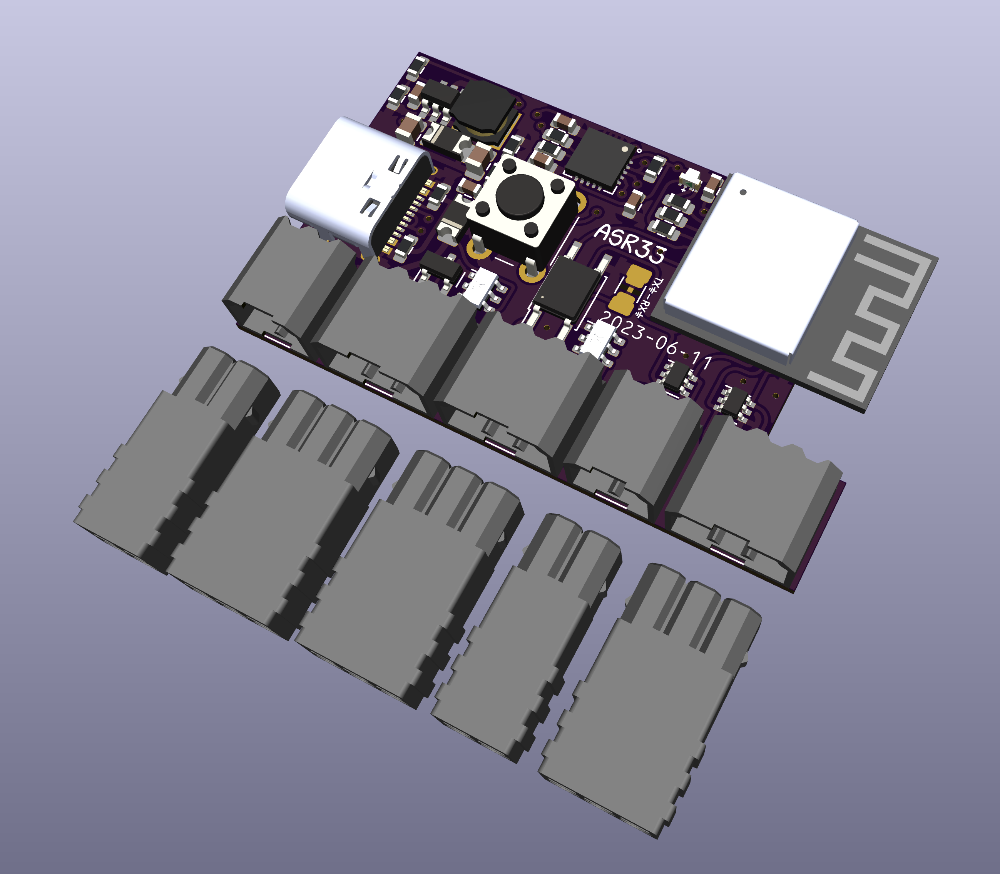
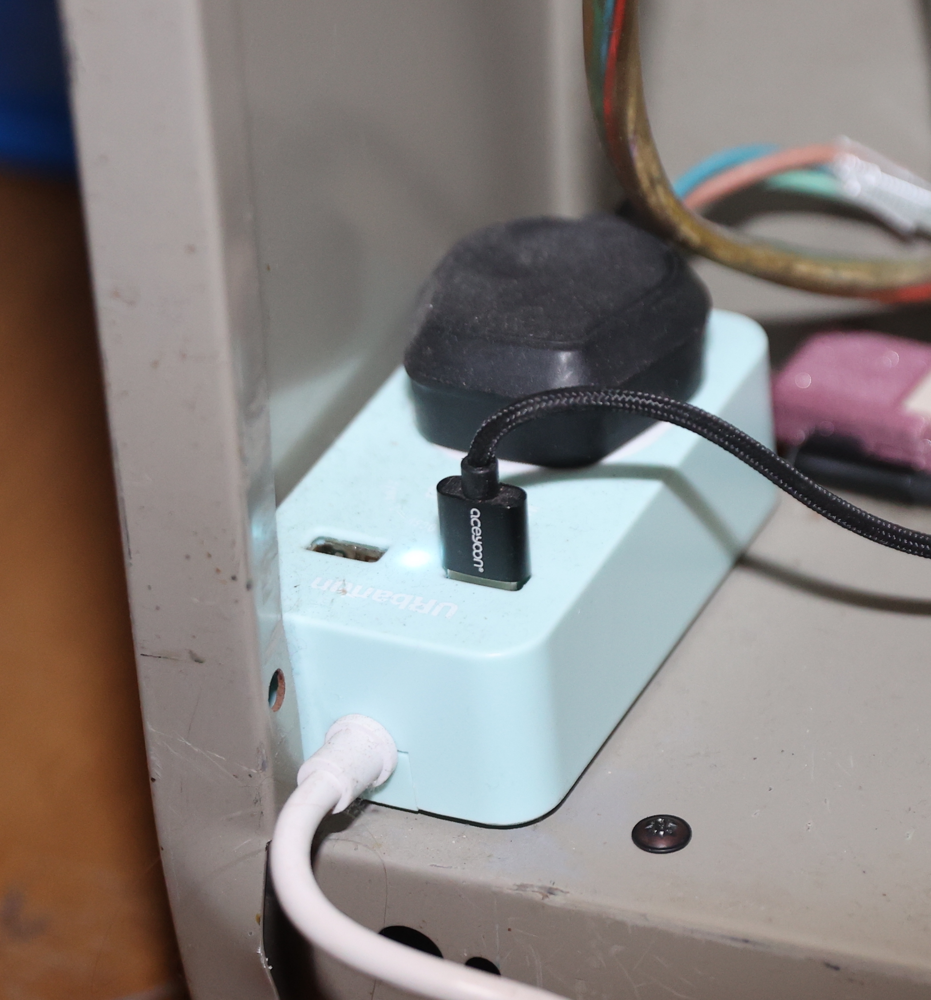
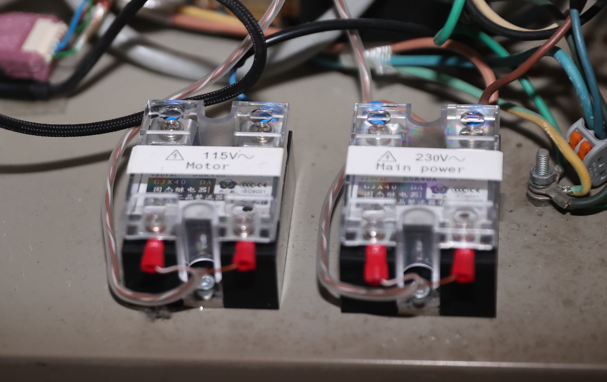
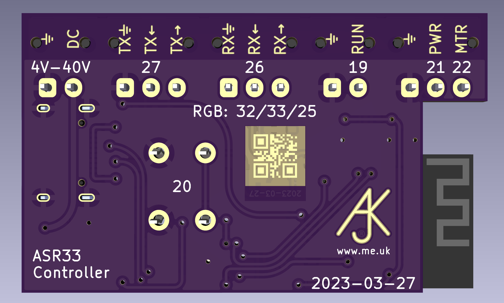

# ASR33 Controller

The ASR33 project consists of software for an ESP32 and a hardware design for an ESP32 based controller. The idea is to provide a WiFi interface that can be fitted in to an ASR33 or similar teletypes. It providing a means to simply connect to the teletype using TCP. But also to send text to the ASR33 over MQTT, and report key presses back over MQTT. The system includes standalone operation with local echo, punching large text on paper tape, and even the Colossal Cave adventure game.

## Hardware

A board design is included, which includes the ESP32, USB serial, and connectors. Note that 0.1” headers can be used instead of these PTSM connectors if more convenient.

The ASR33 has a Tx and Rx pair that work passively, using 20mA current loop at 110 Baud. However there are additional connections for a start/stop (RUN) button, and control of power (PWR) and motor (MTR) via external solid state relays or using MQTT connected power switches. The board can be powered by USB, or an external DC supply. A typical passive 20mA loop ASR33 can work solely using USB power.

Note this document describes the new ESP32-PICO-MINI-02 based board.

### USB

The hardware has a USB-C connector that is used for power. In my ASR33 I have a simple one gang extension lead which has USB power, and this is used with a USB lead to power the controller.

The USB is also used for programming the ESP32 module. It can be used with your own software for serial USB, but note that RTS is used to control the reset line (EN) so should not be asserted. DTR is connected to GPIO0. This arrangement works with the ESP IDF `esptools` to allow flashing of the ESP32.

The unit can alternatively be powered by DC supply (4V-40V)

### Power and motor control

Because the motor normally starts and stops with the power, there is also control of a secondary motor control (e.g. solid state relay or MQTT connected device) to independently start the motor. In the case of my ASR33 I have run an additional two core cable connected in line with the motor power cable internally so as to allow motor control. This means the motor starts and stops while the main power is on, and avoids clocking in and printing a random character on start up. The hardware design includes a connector with ⏚, PWR and MTR. The PWR and MTR are simple 3.3V outputs to work a solid state relay. However you can also configure the unit to send MQTT commands to control tasmota based designs (e.g. a Shelly Plus 1) to control the power and/or motor.

In the case of my ASR33 I have two solid state relays in the base of the unit :-

### Connections

The connections are via PTSM 2.5mm, or 0.1” headers. The pins are marked on the back of the board as follows.

### Start/stop button

The system is also designed to work with a start/stop button. In my ASR33 there is a MOTOR START button, which has been rewired to simply work as a push button to the connector on the ASR33 controller board. It has ⏚ and RUN, which are simply connected together to work as the start/stop button. Power will turn off after configured timeouts and if TCP connection is closed, etc.

### Tx and Rx

The ASR33 is normally passive, so the SEND from the ASR33 simply makes or breaks a loop, and for RECEIVE it expects a low voltage 20mA loop which the sender makes or breaks.

#### Passive teletype connections

Connect the SEND side of teletype to `RX→` and `RX←`, where `RX→` is the current source to teletype.
Connect the RECEIVE side of teletype to `TX→` and `TX←`, where `TX→` is the current source to teletype.

#### Active SEND

Connect the SEND side to `RX⏚` and `RX←` where current flows to `RX←` from teletype.

#### Active RECEIVE

Connect the RECEIVE side to `TX⏚` and `TX←` where current flows to `TX←` from teletype.

#### Isolated Tx/Rx

Normally `TX⏚` and `RX⏚` are connected internally. If using an active SEND, so `RX⏚` and `RX←`, you can isolate the `RX⏚` from `TX⏚` by cutting the link on the back of the board.

## Software

The software is designed to run on an ESP32, which could be the ASR33 hardware, or a more generic module. It allows a number of settings controlled via MQTT.

If it does not connect to WiFi it starts an AP and can be accessed via a web browser to set the SSID, password, and MQTT server to use.

It includes:-

- Accepts connections on a TCP port, powering on whilst connected and passing 8 bit are bytes to/from the serial interface.
- Can make a TCP connection to IP/host as entered at a prompt, or configured to connect on power on.
- Can be configured to 5, 6, 7, or 8 data bits, and 1, 1½, or 2 stop bits and very low Baud rates, such as 45.45 Baud. But normally 110 Baud.
- Run/stop button control, but will also run if Rx byte, so can work without power control if needed.
- Simple local echo
- Response to WRU with version and a configurable string
- Response to DC2/DC4 by starting the punch and punching big letters for what is typed
- Response to Hayes +++ with a prompt to connect over TCP or play a game
- MQTT commands to print text, punch tape, and punch large letters on tape
- MQTT report of key presses received

### Local working

Normally, when on, you can have local echo or not, sending typed keys via MQTT.

However you can get a prompt with more details by using a Hayes escape. This is, at start of line, over one second pause, `+++` (with no pauses), then one second pause.

The prompt allows you to start the Colossal Cave game, or make an outgoing TCP connection over WiFi.
### Settings

See [RevK](https://github.com/revk/ESP32-RevK) library for details of how to store settings using MQTT, and for additional settings.
E.g. sending mqtt message `setting/ASR33/XXXXXXXXXXXX/databits 8` or using JSON, e.g.  `setting/ASR33/XXXXXXXXXXXX {“databits”:8}`

*Note: prefix GPIO with `-` for inverted operation of pin - e.g. `RX` has a FET and so is inverted.*

|Setting|Recommended|Meaning|
|-------|----|-------|
|`tx`|`27`|GPIO for `TX`|
|`rx`|`-26`|GPIO for `RX`|
|`rxpu`|`true`|Apply pull up to `RX`|
|`run`|`-19`|GPIO for `RUN` (START) button|
|`pwr`|`21`|GPIO for `PWR` (power) output|
|`mtr`|`34`|GPIO for `MTR` (motor) output|
|`port`|`33`|TCP port for incomming connections|
|`uart`|`-1`|Internal UART ID, use `-1` for soft UART for 110 Baud|
|`baudx100`|`11000`|Baud rate (x100), designed to allow very low Baud, e.g. 45.45 Baud is `4545`, etc. Only whole Baud rates above 110 for hardware UART.|
|`databits`|`8`|Data bits, supports any number from 1 to 8 bytes. Note, parity is not handled internally, so as to allow full control of paper tape, etc. As such this is normally set to 8 even for the 7 bit even parity working of an ASR33. Only 5 to 8 bits for hardware UART.|
|`stopx2`|`4`|Stop bits (x2) - can only be 1, 1½, or 2 stop bits for hardware UART. Note that this only affects transmit - receive will always accept 1 stop bit. Half stop bits may be adjusted in soft UART working, e.g. 1.6 stop bits sent instead 1½.|
|`linelen`|`72`|How many print columns|
|`crms`|`200`|Number of milliseconds extra after CR before next printable char, for carriage starting on far right.|
|`blink`|`-32 -33 -25`|GPIO for onboard LED (R/G/B)|
|`apgpio`|`-13`|GPIO to force WiFI AP mode for config|
|`noecho`|`false`|No local echo|
|`nobig`|`false`|No large text punch on DC2|
|`nover`|`false`|No version info on the answerback|
|`nocave`|`false`|No Colossal Cave game|
|`nodc4`|`false`|Np DC4 control|
|`autocave`|`false`|Run Cossal Cave on `RUN`|
|`autoprompt`|`false`|Start control prompt on RUN, allows outgoing TCP or start game, same as `+++`|
|`autoon`|`false`|Do `RUN` on system startup|
|`autoconnect`||Hostname or IP to connect to when power turned on|
|`pwrtopic`||Topic to send with `0`/`1` payload to control external power via tasmota|
|`mtrtopic`||Topic to send with `0`/`1` payload to control external motor via tasmota|
|`idle`|`1`|Time to idle at end of print|
|`keyidle`|`600`|Time to idle if keyboard in use|
|`ack`|`6`|`ACK` character to send at end of answer back|
|`wru`||Answerback to send (incldues version unless `nover` is set)|
|`think`|`10`|Thinking time (number of nulls to send after each input) when playing colossal cave|
|`tapelead`|`15`|Blank tape at start of large text|
|`tapetail`|`15`|Blank tape at end of large text|

### Commands

A number of commands can also be sent in the same style, e.g. `command/ASR33/XXXXXXXXXXXX/tape HELLO WORLD`.

|Command|Meaning|
|-------|-------|
|`on`|Turn on power|
|`off`|Turn off power|
|`cave`|Start colossal cave|
|`echo`|Set local echo on|
|`noecho`|Set local echo off|
|`break`|Send a break (can provide number of characters to send, default `10`)|
|`tape`|Print large text on paper tape (gibberish on paper)|
|`taperaw`|Print text with paper tape punch on|
|`text`|Print text (has some substitutions for unprintable characters)|
|`line`|As `text` but with `CR`/`LF`|
|`bell`|As `line` but with `BELL` as well|
|`tx`|Send data to teletype (hex)|
|`punch`|Send data to teletype (hex) with tape punch on (punch lead in and out blanks)|
|`punchraw`|Send data to teletype (hex) with tape punch on (no lead in or out)|
|`uartstats`|Reports UART stats, and clears them|
