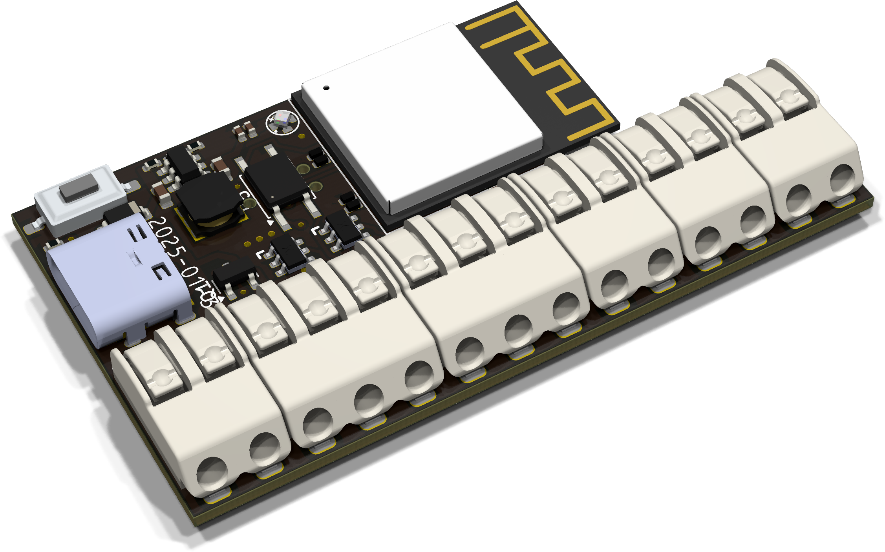

## Trademark

This is an open source project, but bear in mind you cannot sell boards bearing the Andrews & Arnold Ltd name, the A&A logo, the registered trademark AJK logo, or the GS1 allocated EANs assigned to Andrews & Arnold Ltd.

# ESP32 ASR33 controller

Hardware and software for ESP32 based controller for ASR33 teletype.

- 20mA current sources for Tx and Rx 110 Baud.
- WiFi connection (IPv4 and IPv6)
- Simple TCP socket to interface to teletype (inbound and outbound)
- MQTT connection
- Includes stand alone Colossal Cave adventure game

This is actually available to buy from [A&A](https://www.aa.net.uk/etc/circuit-boards/) and [Tindie](https://www.tindie.com/products/revk/asr33-teletype-controller-development-board/)

[More details](Manuals/ASR33-Controller.md)

# Building

Git clone this `--recursive` to get all the submodules, and it should build with just `make`. That actually runs the normal `idf.py` to build. `make menuconfig` can be used to fine tune the settings, but the defaults should be mostly sane. `make flash` should work to program.
